# Fractales

Hubo una persona que se topó de lleno con este problema del mapa y el territorio.
En 1967 Benoit Mandelbrot publicó un texto titulado _How Long Is the Coast of Britain?_ (_"Cuánto mide la costa de Bretaña"_) en el que examinaba la paradoja de la costa.

Si uno mide una "costa" con una regla de 200km obtiene un resultado muy diferente del que obtiene si la mide con una regla de 50km. Cuanto menor sea el tamaño de la regla, más puede dar cuenta de las pequeñas entradas, rivetes y firuletes que hace aquí y allá el contorno.


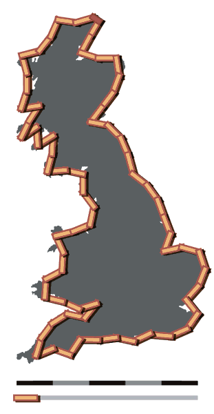

Durante cientos de años, desde Leibniz para acá, los fractales venían siendo estudiados como artefactos matemáticos, y con representaciones construídas a mano alzada. No se tenían las herramientas para construir las visualizaciones que tenemos hoy.

Leibniz también propuso imaginar un círculo, luego inscribir dentro de él tres círculos congruentes con radio máximo; los últimos círculos más pequeños podrían llenarse con tres círculos aún más pequeños mediante el mismo procedimiento. Esto podría ser continuado indefinidamente.

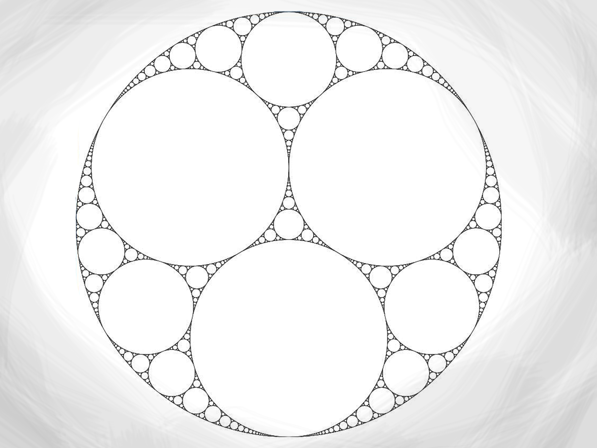

En 1975, Mandelbrot solidificó cientos de años de pensamiento y desarrollo matemático al acuñar la palabra "fractal" e ilustró su definición matemática con impresionantes visualizaciones construidas por computadora. Estas imágenes, como las de su conjunto canónico de Mandelbrot, capturaron la imaginación popular; muchos de ellos se basaron en la recursividad, lo que llevó al significado popular del término "fractal".

Lo notable de estas imágenes, era que se construían con la repetición a diferentes escalas de un mismo proceso. Los programas que se usaban para describirlas terminaban reflejando ese patrón en la llamada recursividad. Así nació un vínculo cautivante entre la computación y los procesos naturales.

Veamos algunos ejemplos...

## Los clásicos

### Curva "C" de Lèvy:

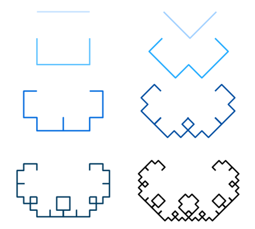

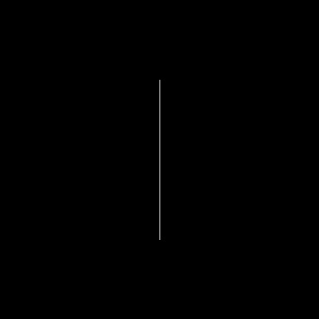

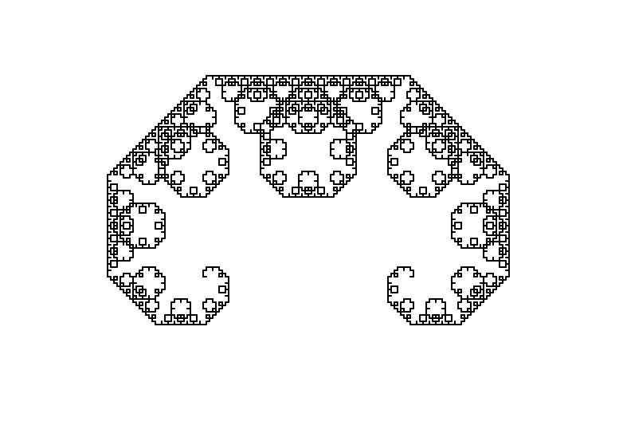

Código en Python:

```python
from turtle import *

speed(0)

def levy(n):
    l=4
    if n == 0:
        forward(l)
    else:
         left(45)
         levy(n - 1)
         right(45)
         right(45)
         levy(n-1)
         left(45)

levy(12)

```

### Árboles:

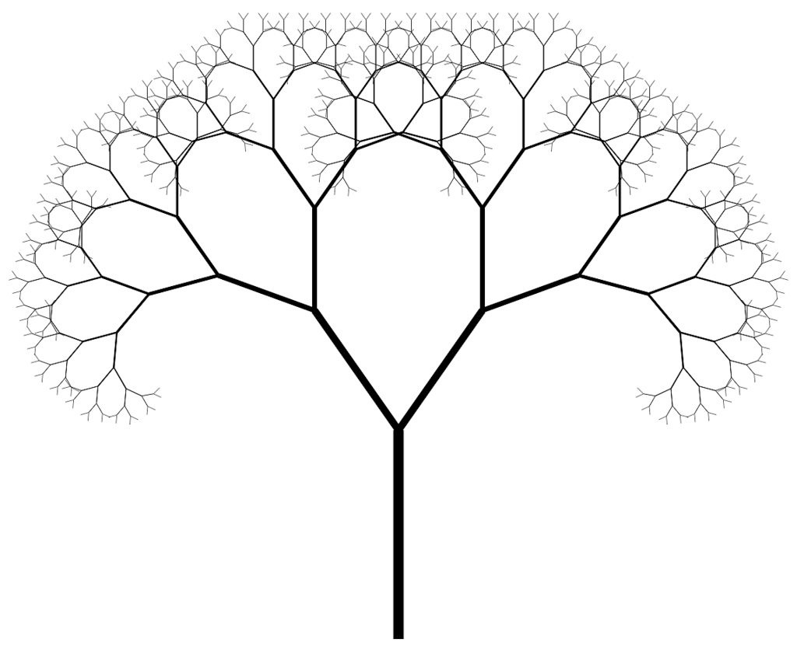

Código en python:

```python
from turtle import *

penup()
goto(0, -200)
seth(90)
pendown()
speed(0)

a = 20
def arbol(l, n=3):
    forward(l)
    if n == 1:
        forward(-l)
        return
    else:
        left(a)
        arbol(l * 0.7, n-1)
        right(2*a)
        arbol(l * 0.7, n-1)
        left(a)
    forward(-l)

arbol(150, 8)

```

### Criba de Sierpinsky:

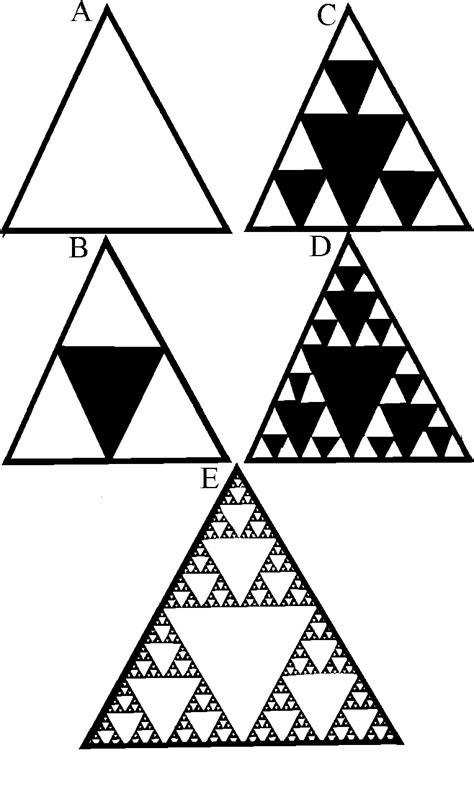

Podemos dibujarla a partir de un árbol fractal de 3 ramas

## Mapas

Vamos a dibujar mapas.

Cuando tenía 16 o 17 años jugaba calabozos y dragones y otros juegos de rol. Uno de mis primeros proyectos de programación fue un creador de hoja de personaje.

Por aquella época me fascinaba la aventura de construir mundos imaginados. Gozaba de confeccionar mapas. Y un amigo que nos dirigía campañas de rol me recomendó un programa llamado fractal mapper. Este programa generaba ríos y masas continentales con bordes que parecían creíbles, y el nombre sugería que algo tenían que ver con los fractales.

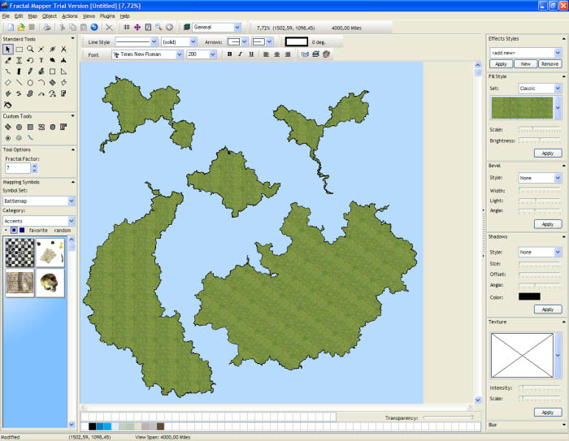

Años más tarde entendí cómo funcionaba, y se los comparto ahora.


Esta clase de procedimiento se utiliza en muchos entornos para dibujar fenómenos aparentemente naturales de muchos tipos. Un ejemplo es la generación de terreno, que se hizo singularmente famosa de la mano del Minecraft. La parte fractal queda encapsulada en la función `noise`, que pudieramos, si quisieran, estudiar algún día.

Terrenos...

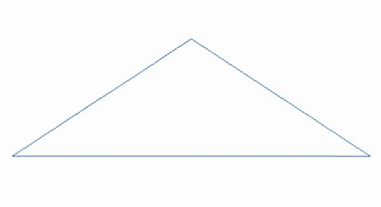

Texturas...

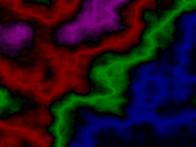

Terrenos agregando texturas, shaders y toda la bola...


## Sistemas L

En 1968 un botanista y biólogo húngaro llamado Aristid Lindenmayer, introdujo un artefacto que luego se llamó sistemas L (por su apellido). Lindenmayer utilizó estos sistemas para describir el comportamiento de las células vegetales y modelar los procesos de crecimiento del desarrollo de las plantas. Los construyó originalmente para modelar el crecimiento de hongos y bacterias.

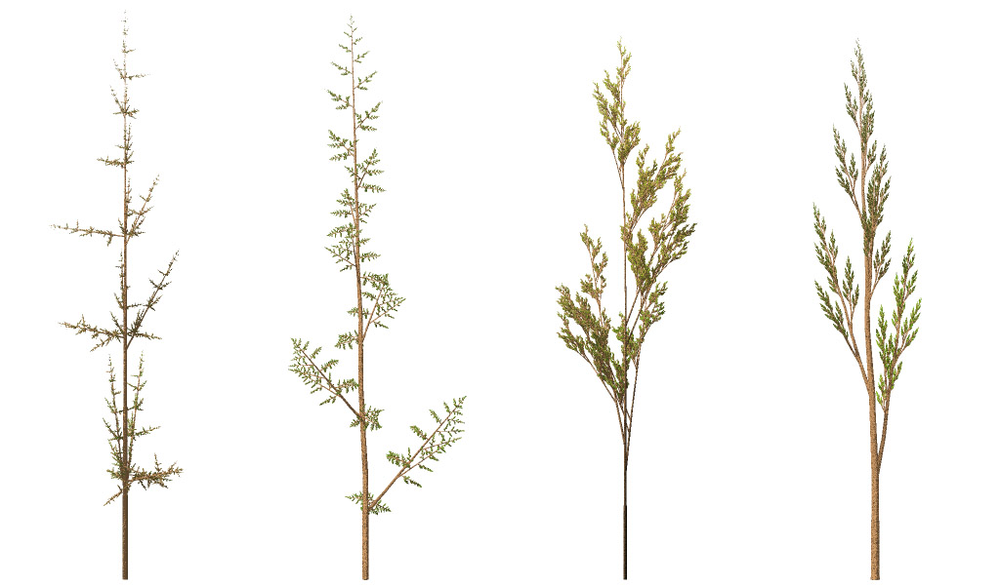

Lo notable en estos sistemas es que se deja todo el procesamiento recursivo en la parte de texto, que es una representación de lo que se va a dibujar, y luego se interpreta éste para producir una imagen instrucción por instrucción.

Con este sistema pueden representarse muchos de los fractales clásicos que vimos al comienzo. También inspiraron desarrollos en lingüística generativa.


## Atractores

La idea de fractales está algo conectada con la de atractores y repulsores, que son puntos en los que convergen o divergen condiciones de equilibrio de un sistema.

Volvamos un momento a los sistemas de la clase pasada. Vimos existen ciertas condiciones que conducen a la estabilidad. Podemos estudiar un sistema estudiando qué pasa en las condiciones circundantes.

Si el sistema tiende a acercarse a esas condiciones, decimos que son un atractor. Si tiende a alejarse de esas condiciones, son un repulsor.

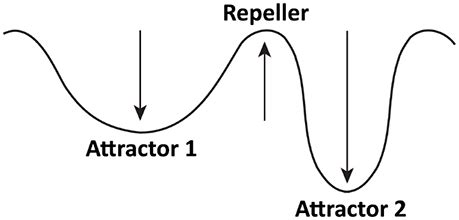

Por ejemplo, para una pelota rodando cuesta abajo, el fondo del valle es un atractor, dado que cuanto más cerca está, más tiende a ir hacia él. Por otro lado, una clava en equilibrio es un repulsor, ya que el menor desplazamiento del punto de equilibrio empieza a alejarla todavía más.

Los atractores caracterizan la evolución de un sistema.

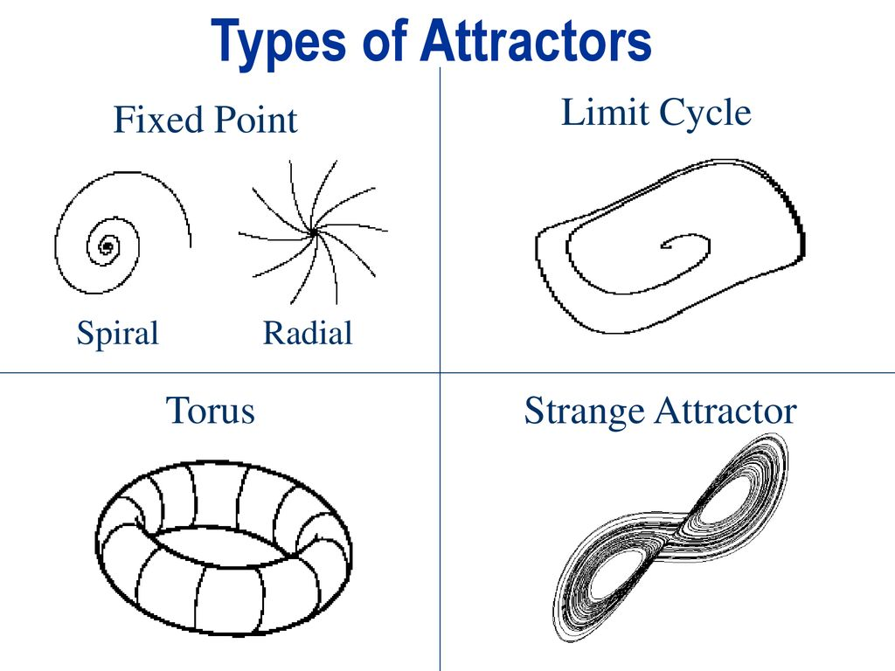

Dependiendo de lo que estemos representando, un atractor puede ser un punto, una línea, un plano, etc... siempre es alguna región en algún espacio. Pues bien, existen atractores con estructura fractal. Suelen aparecer en sistemas en los que los resultados varían mucho con las condiciones iniciales (lo que se conoce como efecto mariposa). Estos sistemas se llaman caóticos, y esto es lo que estudia la teoría del caos.

Existió un tipo llamado Edward Lorenz, que intentó modelar el clima, con variables como temperatura y presión, y terminó encontrando un atractor caótico. Hoy lo llamamos el atractor de Lorenz. Puntos que comienzan pueden terminar lejos y viceversa, pero siempre dentro del atractor. Por eso se dice que el atractor es globalmente estable pero localmente inestable.

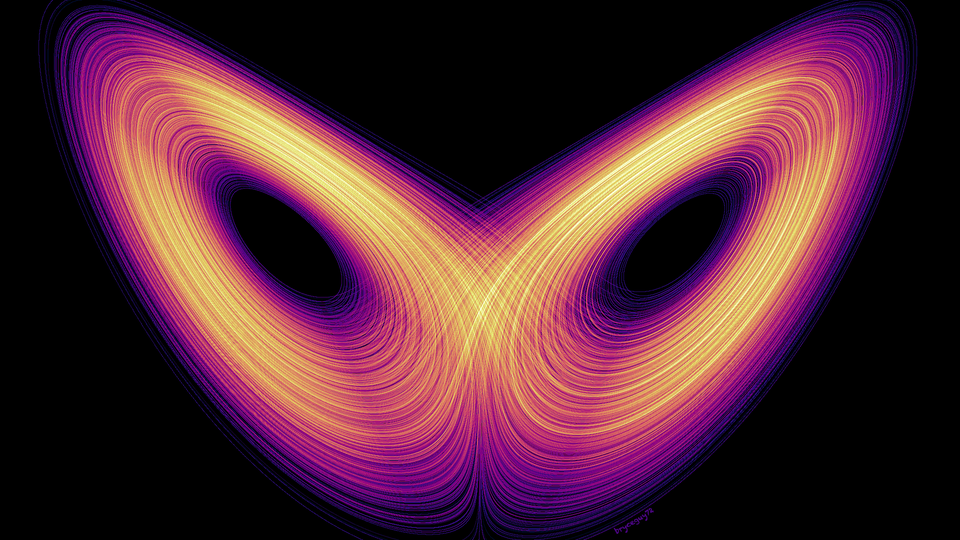

Esta muestra algo que encuentro hermoso de la matemática y la computación: nos permiten hacer zoom al misterio y la incertidumbre de la naturaleza. Lorenz terminó afirmando -en 1972- que es imposible predecir el clima pasado cierto tiempo, y aún hoy afirmamos lo mismo.

De allí que se acuñara el "Efecto mariposa" para sistemas en los que pequeñas variaciones en las condiciones iniciales impactan enormemente en el futuro desarrollo del sistema. Esto dio paso a una área entera de la matemática que estudia estos fenómenos, y se llama "Teoría del caos". Una de sus más clásicas y estudiadas imágenes es un fractal que tal vez recuerden...

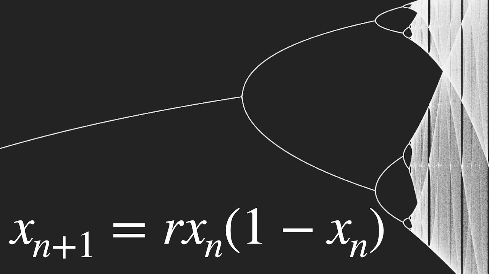


### Recursos
+ [Ríos en Scratch](https://scratch.mit.edu/projects/551161908/)
+ [Space-filling curves 3b1b](https://www.youtube.com/watch?v=RU0wScIj36o)
+ [Proyectos para entrenar turtle](https://pythonturtle.academy/)
+ [Apollonian Gasket interactivo](http://www.malinc.se/math/geometry/apolloniangasketen.php)
+ [Conjuntos de Julia en smoothstep.io](https://smoothstep.io/anim/70bef4ffb215)
+ [L-systems en wikipedia](https://en.wikipedia.org/wiki/L-system)
+ [Visualización de varios atractores caóticos](https://www.youtube.com/watch?v=idpOunnpKTo)
+ [Compute-it juego de programación](https://compute-it.toxicode.fr/)
